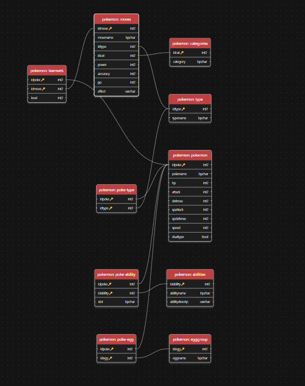

# Esquema SQL 2C25

Este repositorio contiene el script de docker compose y el script inicial para poblar la base de datos PostgreSQL. Se adjunta un diagrama de las tablas del schema:

ATENCIÓN: La idea original de este esquema es de Ignacio Suárez Andrés, y podemos encontrar el trabajo original en [este link](https://github.com/nachosandres/database).
